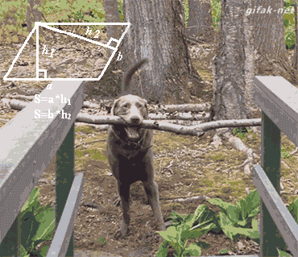

# *Monoids*

#### ~~It's too dangerous to go alone~~
#### I have no idea what I'm doing
---

#Paulo Diniz

<br><br><br><br><br>
- _**Bitcrowd**_ :heart:
- twitter.com/paulodiniz
- github.com/paulodiniz

---

# Mathematicians
<br>
$$ 1 + 2 = 3 $$
<br>

- Bunch of things (integers)
- A way to combine them (addition)
- The result is another of these thing (integer)

---

#[fit] Does the order of the operations matter?

---

$$1 + 2 + 3 = (1 + 2) + 3 = 1 + (2 + 3) $$:+1:

$$1 * 2 * 3 = (1 * 2) * 3 = 1 * (2 * 3) $$:+1:

$$1 / 2 / 3 = (1 / 2) / 3 = 1 / (2 / 3) $$:-1:

---

#[fit] It depends on on the *stuff* and the *operation*

---

# Monoids

<br><br>
1. A bunch a things
2. A way to combine them
3. Follow rules of associativity and identity

---

# Associativity
<br>
<br>
$$ 1 + 2 + 3 = 1 + (2 + 3) = (1 + 2) + 3 $$

---

# Identity Element
<br>
$$ 1 + 0 = 1 $$ 

_**and**_

$$ 0 + 1 = 1 $$

---

# Why do I care about this?

---

# Divide and conquer

---

$$ 1 + 2 + 3 + 4$$
<br>
$$ (1 + 2) + (3 + 4) $$
<br>
$$ sum1To2 + sum2To3 $$

---

# Merge sort

##Integers under *max* operation are monoids

```ruby

     max(3, max(4, 12)) == max(max(3, 4), 12)
```

---

# Parallelization

---

$$ (1 + 2) + (3 + 4) $$

---

```ruby
class Text
  attr_reader :content
  def initialize(content)
    @content = content
  end

  def +(other)
    Text.new(self.content + " " + other.content)
  end

  def ==(other)
    self.content == other.content
  end
end
```

---

#[fit] Is Text under addition is a monoid?

---

# Associativity
<br>

```ruby
Text.new("wow") + Text.new("much") + Text.new("monoid")

Text.new("wow") + (Text.new("much") + Text.new("monoid"))

(Text.new("wow") + Text.new("much")) + Text.new("monoid")

```
:+1:

---

# Identity element

<br>

```ruby

Text.new("") + Text.new("much wow") == Text.new("much wow")

Text.new("much wow") + Text.new("") == Text.new("much wow")
```
:+1:

---

```ruby
def word_count(text)
  text.content.split(' ').length
end
```

---

```ruby
word_count(Text.new('wow much monoid'))
=> 6
```
---

```ruby
word_count(Text.new("wow " *1000) + Text.new("such " * 1000) + Text.new("text " * 1000))
=> 3000

```
---

<!--  -->
#[fit] Is there a _**better**_ way?


---

*word_count* is a monoid

_**because**_

*integers* under addition are monoids

---

What if we apply *word_count* on each page 
and then sum the results? Do we get the same result?

---

- Text under addition is a monoid
- Integer under addition is a monoid

---


---

We have to make sure that *word_count* doesn't
change the _**shape**_ of the transformation
## *homomorphism*

---

# Shape

<br>

$$ f(x * y) = f(x) * f(y) $$


---

# Shape



```ruby

word_count(part1 + part2) = word_count(part1) + word_count(part2)

```

---

```ruby
texts = [ Text.new("wow " * 1000), Text.new("such " * 1000), Text.new("text " * 1000) ]

word_count(texts.reduce(&:+)) #=> 3000

texts.map { |t| word_count(t) }.reduce(&:+) #=> 3000

```

---

```ruby
texts = [ Text.new("wow " * 1000), Text.new("such " * 1000), Text.new("text " * 1000) ]

Parallel.map(texts, in_threads: 3) do |text|
  word_count(text)
end.reduce(&:+) # => 3000

```

---

# Questions?

---


